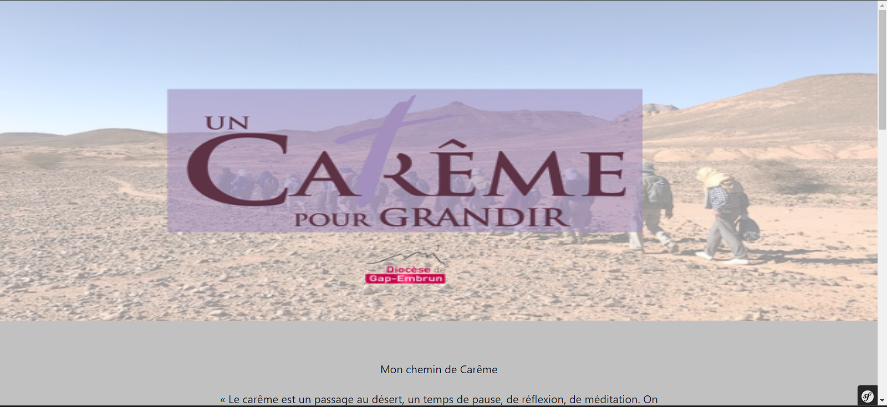

> [!NOTE]
> Ce répertoire renferme les fichiers du projet de site événementiel consacré à Pâques, réalisé dans le cadre de mon stage de deuxième année en BTS SIO au lycée Dominique Villars.

# Site évènementiel de Pâques 

 ## Objectifs
  - Faire un site évènementiel pour la fête de Pâques.
  - Attirer l'attention des personnes sur des fêtes religieux.
  - Porter le site à évoluer et parler d'autre fêtes que Pâques.

## Liste de tâches
- [X] Tâche A : Faire des recherches sur la fête de Pâques.
- [X] Tâche B : Lister les informations obtenues.
- [X] Tâche C : Création d'une maquette
- [X] Tâche Jalon : Jalon de présentation du projet en l'état actuel.
- [X] Tâche D : Commencer la création du projet en symfony + mise en place des fichiers sur github.
- [X] Tâche E : Intégrer boostrap au projet.
- [ ] Tâche F : Intégrer easyAdmin au projet.
- [ ] Tâche G : Créer les entités nécéssaire au projet.
- [ ] Tâche H : Creation des différentes pages du projet (Sans Style).
- [ ] Tâche Jalon2 : Jalon de présentation du projet en l'état actuel.
- [ ] Tâche I : Stylisation des pages du projets.
- [ ] Tâche Jalon3 : Jalon de présentation du projet en l'état actuel.
- [ ] Tâche J : Création de la partie admin notament les contrôleurs.

## Diagramme

## Liste des languages utilisés
- PHP
- scss
- twig

## Architecture du site

## Conçu par
:wave: Bastien Raoult

## Conçu pour
:church: Diocèse de Gap

## Cadre de la réalisation
Stage de deuxième année de <b>BTS SIO</b> au lycée Dominique Villars

## Les liens
- [Suivie de stage.](https://docs.google.com/document/d/19riinlN57bzkztlI_Pb8UdQf1YqKHO0ervbC9oBJK6Q/edit#heading=h.mbjsiz6n6jlo)
- [Cahier des charges.](https://docs.google.com/document/d/1P0kyywvMcfMYqyHCLGkM-YLVYJBDp6XoYpLlRj58eXc/edit)
- [Maquettes du site de Pâque.](https://www.figma.com/file/djjyoE4gJxyb7ZBRsuklYQ/Dioc%C3%A8se-Gap?type=design&node-id=0-1&mode=design&t=xzWRQ3dhKk9a0I7z-0)
- [Maquette du site de l'école de Saint Coeur.](https://www.figma.com/file/Z88W21siLG6TkDl0R2A7S5/Ecole-Saint-Coeur?type=design&node-id=0-1&mode=design&t=YSzzvPmzmqze3jq8-0)
- [Diagramme npm.](https://app.diagrams.net/#G1FJQcjcVBjJwD1fVKMcPn8zz_wdhhxCQq)
- [Hiérarchie du Diocèse de Gap.](https://miro.com/app/board/uXjVN8CY260=/)
